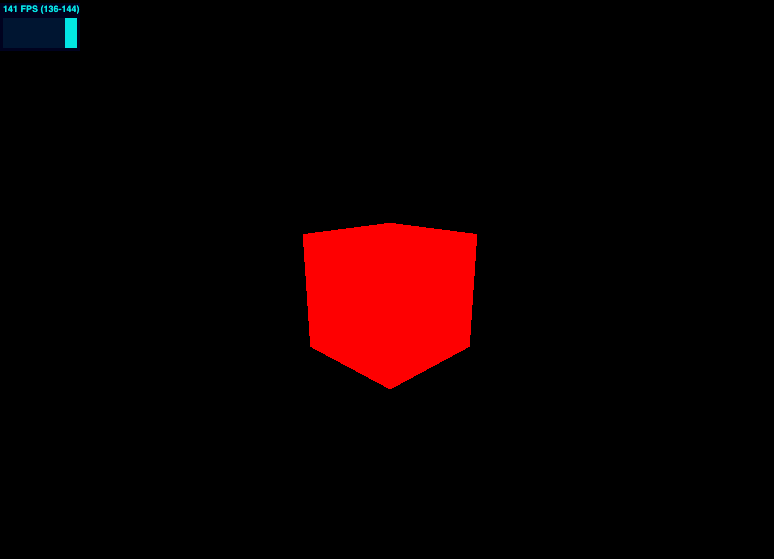
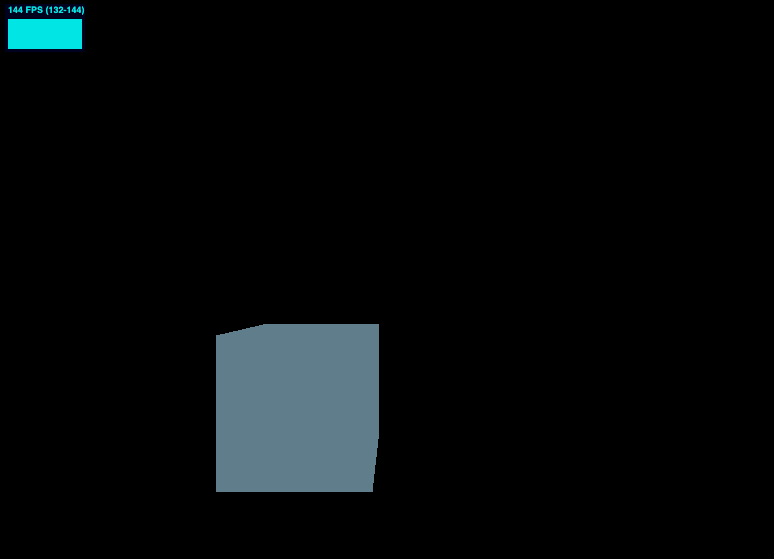
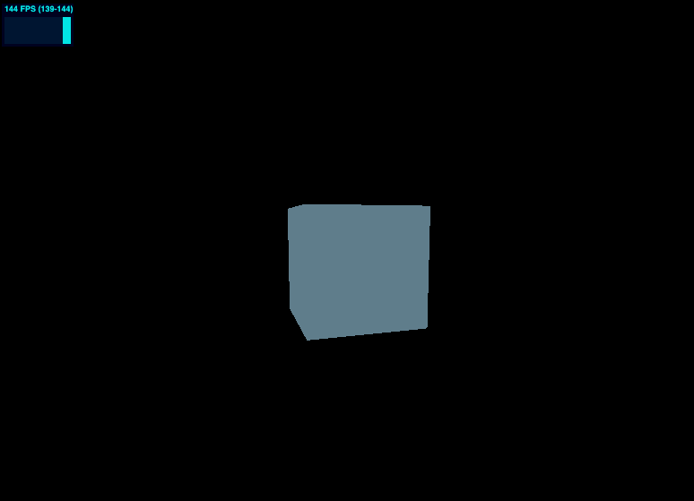
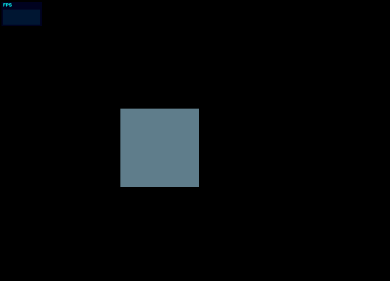

animation 动画

# 基于时间间隔

使用 requestAnimationFrame 获取时间差，运动基于这个时间

```ts
import * as THREE from 'three'
import stats from '../common/stats'

// Canvas
const canvas = document.querySelector('#mainCanvas') as HTMLCanvasElement

// Scene
const scene = new THREE.Scene()

// Object
const cube = new THREE.Mesh(
  new THREE.BoxGeometry(1, 1, 1),
  new THREE.MeshBasicMaterial({
    color: 0xff0000,
  }),
)
scene.add(cube)

// Camera
const camera = new THREE.PerspectiveCamera(75, canvas.clientWidth / canvas.clientHeight)
camera.position.set(1, 1, 3)
camera.lookAt(cube.position)

// Renderer
const renderer = new THREE.WebGLRenderer({
  canvas,
})
renderer.setSize(canvas.clientWidth, canvas.clientHeight)

// Time
let time = Date.now()

// Animations
const tick = (currentTime: number) => {
  stats.begin()
  const deltaTime = currentTime - time
  time = currentTime

  cube.rotation.y += 0.001 * deltaTime

  // Render
  renderer.render(scene, camera)
  stats.end()
  requestAnimationFrame(tick)
}

tick(0)
```



# 基于 THREE 内置的 Clock

## `clock.getDelta()` 实现动画

```ts
import * as THREE from 'three'
import stats from '../common/stats'

// Canvas
const canvas = document.querySelector('#mainCanvas') as HTMLCanvasElement

// Scene
const scene = new THREE.Scene()

// Object
const cube = new THREE.Mesh(
  new THREE.BoxGeometry(1, 1, 1),
  new THREE.MeshBasicMaterial({
    color: 0xff0000,
  }),
)
scene.add(cube)

// Camera
const camera = new THREE.PerspectiveCamera(75, canvas.clientWidth / canvas.clientHeight)
camera.position.set(1, 1, 3)
camera.lookAt(cube.position)

// Renderer
const renderer = new THREE.WebGLRenderer({
  canvas,
})
renderer.setSize(canvas.clientWidth, canvas.clientHeight)

// Clock
const clock = new THREE.Clock()

// Animations
const tick = () => {
  stats.begin()

  const delta = clock.getDelta()

  cube.rotation.y += 1 * delta

  // Render
  renderer.render(scene, camera)
  stats.end()
  requestAnimationFrame(tick)
}

tick()
```

效果同上一个 demo

关于 [Clock 详见 threejs 文档](https://threejs.org/docs/index.html#api/zh/core/Clock)

该对象用于跟踪时间。如果performance.now可用，则 Clock 对象通过该方法实现，否则回落到使用略欠精准的Date.now来实现。

- `.getElapsedTime () : Float`
获取自时钟启动后的秒数，同时将 .oldTime 设置为当前时间。
如果 .autoStart 设置为 true 且时钟并未运行，则该方法同时启动时钟。

- `.getDelta () : Float`
获取自 .oldTime 设置后到当前的秒数。 同时将 .oldTime 设置为当前时间。
如果 .autoStart 设置为 true 且时钟并未运行，则该方法同时启动时钟。

## 圆周运动

使用三角函数，可以让物体在三维空间做圆周运动

效果如下



```ts
import * as THREE from 'three'
import stats from '../common/stats'

// Canvas
const canvas = document.querySelector('#mainCanvas') as HTMLCanvasElement

// Scene
const scene = new THREE.Scene()

// Object
const cube = new THREE.Mesh(
  new THREE.BoxGeometry(1, 1, 1),
  new THREE.MeshBasicMaterial({
    color: 0x607D8B,
  }),
)
scene.add(cube)

// Camera
const camera = new THREE.PerspectiveCamera(75, canvas.clientWidth / canvas.clientHeight)
camera.position.set(0, 0, 3)
camera.lookAt(cube.position)

// Renderer
const renderer = new THREE.WebGLRenderer({
  canvas,
})
renderer.setSize(canvas.clientWidth, canvas.clientHeight)

// Clock
const clock = new THREE.Clock()

// Animations
const tick = () => {
  stats.begin()

  const elapsedTime = clock.getElapsedTime()

  cube.position.y = Math.sin(elapsedTime)
  cube.position.x = Math.cos(elapsedTime)

  // Render
  renderer.render(scene, camera)
  stats.end()
  requestAnimationFrame(tick)
}

tick()
```

其中核心代码是这 2 行

```ts
cube.position.y = Math.sin(elapsedTime)
cube.position.x = Math.cos(elapsedTime)
```

当然我们也可以让物体不动，让相机运动出现的效果相同

```ts
camera.position.y = Math.sin(elapsedTime)
camera.position.x = Math.cos(elapsedTime)
```

还可以让相机在圆周运动的同时总是指向物体，效果如下

```ts
// Animations
const tick = () => {
  stats.begin()

  const elapsedTime = clock.getElapsedTime()

  camera.position.y = Math.sin(elapsedTime)
  camera.position.x = Math.cos(elapsedTime)
  camera.lookAt(cube.position)

  // Render
  renderer.render(scene, camera)
  stats.end()
  requestAnimationFrame(tick)
}
```



## 使用 GSAP 实现动画

```ts
import * as THREE from 'three'
import gsap from 'gsap'
import stats from '../common/stats'

// Canvas
const canvas = document.querySelector('#mainCanvas') as HTMLCanvasElement

// Scene
const scene = new THREE.Scene()

// Object
const cube = new THREE.Mesh(
  new THREE.BoxGeometry(1, 1, 1),
  new THREE.MeshBasicMaterial({
    color: 0x607d8b,
  })
)
scene.add(cube)

// Camera
const camera = new THREE.PerspectiveCamera(75, canvas.clientWidth / canvas.clientHeight)
camera.position.set(0, 0, 3)
camera.lookAt(cube.position)

// Renderer
const renderer = new THREE.WebGLRenderer({
  canvas,
})
renderer.setSize(canvas.clientWidth, canvas.clientHeight)

gsap.fromTo(
  cube.position,
  {
    x: -1.5,
  },
  {
    x: 1.5,
    duration: 1,
    yoyo: true,
    repeat: -1,
    ease: 'sine.inOut',
  },
)

// Animations
const tick = () => {
  stats.begin()

  // Render
  renderer.render(scene, camera)
  stats.end()
  requestAnimationFrame(tick)
}

tick()
```


